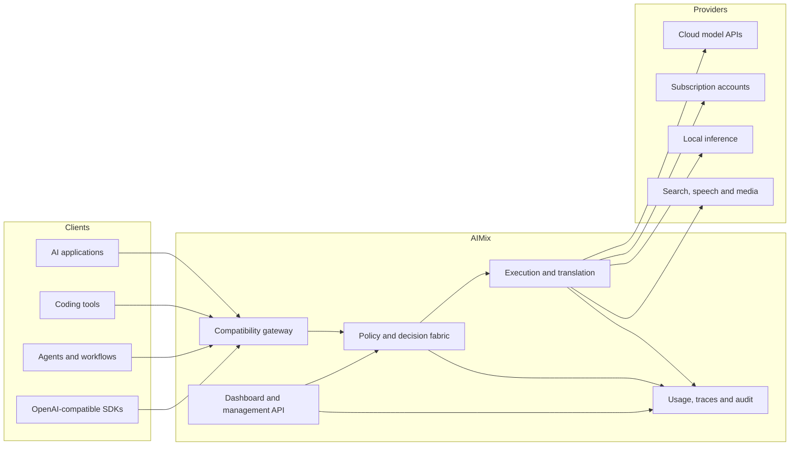

<div align="center">
  

  # AIMix

  ### One gateway. Every model. Smart execution.

  **A self-hosted AI gateway and decision fabric for models, agents, developer tools, and multimodal workloads.**

  [](./LICENSE)
  [](./package.json)
  [](./package.json)
  [](./DOCKER.md)
  [](./open-sse/providers/registry)
  [](./tests/unit)

  [Quick start](#quick-start) · [Features](#features) · [How it works](#how-it-works) · [API](#api-quickstart) · [Deployment](#deployment) · [Documentation](#documentation)
</div>

---

## Overview

AIMix turns fragmented AI infrastructure into one controllable execution layer. Connect AI coding tools, applications, agents, cloud APIs, and local inference runtimes to a single gateway—then route each workload according to capability, policy, health, latency, quota, and cost.

It can operate as a straightforward compatibility proxy or as an adaptive decision fabric:

- **Direct routing** keeps explicit `provider/model` requests deterministic.
- **Adaptive routing** filters unsafe or incompatible candidates before scoring eligible options.
- **Fallback execution** handles account limits, upstream failures, and capability mismatches.
- **Control-plane APIs** expose decisions, traces, policies, workflows, memory, simulations, and diagnostics.

> [!IMPORTANT]
> The ecosystem catalog is intentionally broader than runtime support. Entries marked `planned`, `discovered`, or `verified` are integration candidates—not active provider implementations.

## Why AIMix?

Most AI applications accumulate one-off provider clients, incompatible streaming formats, scattered credentials, hardcoded model names, and fallback logic that is difficult to observe. AIMix centralizes those concerns.

| Without a gateway | With AIMix |
| --- | --- |
| Separate SDK and retry logic for every provider | One compatible API surface |
| Model changes require application releases | Routes, aliases, and policies are managed centrally |
| Provider outages become application outages | Health-aware account and provider fallback |
| Cost controls live in spreadsheets | Budgets, normalized cost, usage, and forecasts |
| Tool output consumes context unchecked | Context planning, optimization, profiles, and caching |
| Routing decisions are opaque | Candidate scores, rejection reasons, traces, and audit events |
| Local and cloud runtimes need different clients | Compatible endpoints share the same control plane |

## Features

### Universal gateway

- OpenAI-, Anthropic-, and Gemini-compatible request surfaces
- Streaming and non-streaming responses
- Chat, responses, image, video, speech, embedding, reranking, and search workloads
- Provider-specific authentication, token refresh, and transport handling
- Model aliases, compatible nodes, combos, and direct provider routes
- Multi-account selection and quota-aware fallback

### Smart execution

- Workload classification and capability negotiation
- Hard privacy, security, provider, model, region, and budget constraints
- Explainable weighted candidate scoring
- Health-aware selection, retry budgets, bounded backoff, and circuit breakers
- Typed fallback graphs rather than uncontrolled retry loops
- Capacity controls, deadlines, and agent-loop detection

### Context intelligence

- Importance-based context planning
- Duplicate and low-value tool-output reduction
- Smart response profiles: `terse`, `terse_lite`, and `terse_ultra`
- Exact and semantic cache primitives with freshness policies
- Scoped memory, retrieval, reranking, deduplication, and citations
- Optional Headroom, RTK, and TokenSave integration descriptors

### FinOps and observability

- Normalized token and cost accounting
- Hard budget enforcement and quota forecasting
- Decision traces and score breakdowns
- Workload fingerprints, anomaly detection, alerts, and incident reconstruction
- What-if simulation for outages, pricing, latency, and traffic changes
- Versioned configuration timeline and rollback support

### Agents and governance

- Role-based access controls and agent action firewall
- Versioned tool registry with permissions and secret declarations
- Recoverable workflow DAGs, checkpoints, and idempotency
- Deterministic output evaluation and regression comparison
- Model arenas, experiments, and approval-gated learning proposals
- Request signing, data classification, redaction, and audit events

### Extensible ecosystem

- 120+ active runtime provider adapters
- Lifecycle-aware catalog covering 200+ providers, tools, protocols, frameworks, and connectors
- Compatible presets for Ollama, vLLM, llama.cpp, LM Studio, LiteLLM, SGLang, LocalAI, TGI, Xinference, NVIDIA NIM, and related runtimes
- Transport-neutral tool manifests
- HTTP, REST, SSE, WebSocket, gRPC, stdio, CLI, MCP, A2A, and OpenAPI transport contracts
- Dashboard, CLI package, JavaScript SDK, and AIMix skills

## How it works



For an adaptive request, AIMix uses the following execution lifecycle:

```text
authenticate → normalize → classify → detect sensitivity
  → resolve policy → apply hard constraints → score candidates
  → enforce health and budget → optimize context → check cache
  → translate → execute → validate → fallback when permitted
  → record trace, usage and audit → stream response
```

Security, privacy, authorization, required capability, and hard budgets are evaluated before soft optimization. A cheaper route cannot override a failed hard constraint.

## Quick start

### Prerequisites

- Node.js 18 or newer
- npm
- Git
- One provider credential or a reachable local model runtime

### Run from source

```bash
git clone <your-aimix-repository-url>
cd aimix
cp .env.example .env
npm install
npm --prefix tests install
npm run dev
```

On Windows PowerShell:

```powershell
Copy-Item .env.example .env
npm install
npm --prefix tests install
npm run dev
```

Development defaults to:

| Surface | URL |
| --- | --- |
| Landing page | `http://localhost:20127` |
| Dashboard | `http://localhost:20127/dashboard` |
| Compatible API | `http://localhost:20127/v1` |
| AIMix management APIs | `http://localhost:20127/api/aimix` |

Open the dashboard, configure authentication, create an AIMix API key, and connect a provider or compatible local endpoint.

## API quickstart

### Chat Completions

```bash
curl http://localhost:20127/v1/chat/completions \
  -H "Authorization: Bearer $AIMIX_API_KEY" \
  -H "Content-Type: application/json" \
  -d '{
    "model": "openai/gpt-4.1-mini",
    "messages": [
      { "role": "user", "content": "Explain this repository in three bullets." }
    ],
    "stream": true
  }'
```

Replace the example model with a model route available in your installation.

### JavaScript

Any OpenAI-compatible client can point to AIMix:

```js
import OpenAI from "openai";

const client = new OpenAI({
  apiKey: process.env.AIMIX_API_KEY,
  baseURL: "http://localhost:20127/v1",
});

const response = await client.chat.completions.create({
  model: "openai/gpt-4.1-mini",
  messages: [{ role: "user", content: "Hello from AIMix" }],
});

console.log(response.choices[0].message.content);
```

The `openai` package above is a client example and is not required by the AIMix server.

### Smart response profile

Clients can request a concise response policy per request:

```bash
curl http://localhost:20127/v1/chat/completions \
  -H "Authorization: Bearer $AIMIX_API_KEY" \
  -H "Content-Type: application/json" \
  -H "x-aimix-profile: terse_lite" \
  -d '{
    "model": "provider/model",
    "messages": [{ "role": "user", "content": "Review this design." }]
  }'
```

Available profiles can be queried from `GET /api/aimix/profiles`.

## Routing modes

### Direct model route

Use an explicit route when predictability is the priority:

```text
provider/model
```

### Compatible local endpoint

Register an OpenAI-compatible endpoint in the dashboard and route supported models through it. AIMix includes presets for common local and self-hosted runtimes, while still allowing custom base URLs.

### Adaptive policy

Adaptive policies filter candidates against hard requirements before scoring. A representative policy shape is:

```json
{
  "objective": "balanced",
  "allowedProviders": ["anthropic", "openai", "ollama"],
  "requiredCapabilities": ["tools"],
  "maxCostPerRequest": 0.25,
  "providerPrivacy": {
    "ollama": "sensitive",
    "anthropic": "private"
  },
  "modelQuality": {
    "ollama/local-code": 0.74,
    "anthropic/claude": 0.95
  }
}
```

Exact accepted fields depend on the active policy and combo APIs. See [AIMix platform overview](./AIMIX.md) and the decision modules under `src/aimix/decision`.

## Supported workload families

| Workload | Gateway support | Examples of integration families |
| --- | --- | --- |
| Chat and reasoning | Yes | OpenAI, Anthropic, Gemini, local inference, hosted gateways |
| Tool calling | Yes, provider-dependent | Coding agents, MCP-backed workflows, compatible chat APIs |
| Images | Yes | Image generation and editing providers, local diffusion endpoints |
| Video | Yes | Hosted video generation providers |
| Speech-to-text | Yes | Cloud and self-hosted transcription |
| Text-to-speech | Yes | Cloud and self-hosted synthesis |
| Embeddings | Yes | Hosted and compatible embedding servers |
| Reranking | Provider-dependent | Hosted rerank APIs and compatible endpoints |
| Search and research | Yes | Search, extraction, and research providers |

Capabilities differ by provider, account type, region, and model. Runtime discovery and provider manifests are authoritative for a configured installation.

## Compatible clients

AIMix is designed for applications that can use OpenAI-, Anthropic-, or Gemini-compatible endpoints, including:

- AI coding assistants and terminal agents
- IDE extensions
- OpenAI-compatible SDKs
- automation and workflow engines
- internal applications and API services
- evaluation and benchmarking harnesses

Some clients require dedicated configuration or protocol translation. See the `gitbook/content/*/integration` documentation for maintained integration guides.

## Deployment

### Production build

```bash
npm run build
PORT=20128 npm run start
```

PowerShell:

```powershell
$env:PORT = "20128"
npm run start
```

### Docker

```bash
docker build -t aimix:local .
docker run --detach \
  --name aimix \
  --publish 20128:20128 \
  --volume "$HOME/.aimix:/app/data" \
  --env DATA_DIR=/app/data \
  --env PORT=20128 \
  aimix:local
```

See [DOCKER.md](./DOCKER.md) for Compose, persistent storage, production configuration, and troubleshooting.

### Before exposing AIMix publicly

1. Enable dashboard authentication.
2. Put the service behind TLS and a maintained reverse proxy.
3. Restrict management APIs to trusted networks.
4. Store secrets outside the image and repository.
5. Disable content logging unless explicitly needed.
6. Back up and protect the data directory.
7. Review the [security policy](./SECURITY.md).

## Configuration

Start from [.env.example](./.env.example). Important runtime settings include:

| Setting | Purpose |
| --- | --- |
| `PORT` | HTTP listening port |
| `HOSTNAME` | Listening interface |
| `DATA_DIR` | Persistent state, database, certificates, and runtime data |
| `NEXT_PUBLIC_BASE_URL` | Public origin used by the application |
| `AIMIX_SIGNING_SECRET` | Optional request-signing secret |

Provider credentials should be configured through protected runtime settings or environment variables. Never commit a populated `.env` file.

## Project structure

```text
aimix/
├── src/app/                 Dashboard and API routes
├── src/aimix/               Decision and execution intelligence
├── src/sse/                 Application streaming handlers
├── src/lib/                 Persistence, auth and runtime services
├── open-sse/                Providers, executors and translators
├── cli/                     CLI and desktop launcher package
├── sdk/                     Client SDKs
├── skills/                  AIMix skills
├── tests/                   Unit, translator and opt-in real tests
├── docs/                    Architecture and design documentation
└── gitbook/                 Multilingual product documentation
```

Read [docs/ARCHITECTURE.md](./docs/ARCHITECTURE.md) before moving responsibilities across these boundaries.

## Development

### Common commands

| Command | Purpose |
| --- | --- |
| `npm run dev` | Start development mode |
| `npm run dev:webpack` | Start development with Webpack |
| `npm run build` | Create a production build |
| `npm run build:verify` | Verify the Turbopack build path |
| `npm run start` | Start the production server |
| `npm run test:aimix` | Run AIMix unit tests |
| `npm run check:docs` | Check Markdown placeholders and local links |
| `npm run check:structure` | Verify the generated provider registry |
| `npm run generate:providers` | Regenerate the provider index |
| `npm run cli:pack` | Build and pack the CLI |

### Adding a provider

1. Start with `open-sse/providers/REGISTRY_TEMPLATE.js`.
2. Add the provider manifest under `open-sse/providers/registry`.
3. Use the generic executor for standard compatible transports.
4. Add specialized translation or execution only when required.
5. Add focused tests without real model traffic.
6. Run `npm run generate:providers`.
7. Run the structural, documentation, lint, and test checks.

See [CONTRIBUTING.md](./CONTRIBUTING.md) for repository conventions and review expectations.

## Documentation

| Document | Purpose |
| --- | --- |
| [Platform overview](./AIMIX.md) | AIMix capabilities and platform contracts |
| [Architecture](./docs/ARCHITECTURE.md) | Boundaries, lifecycle, state, reliability, and extensions |
| [Docker guide](./DOCKER.md) | Container deployment and operations |
| [CLI guide](./cli/README.md) | CLI development and usage |
| [Security policy](./SECURITY.md) | Vulnerability reporting and hardening |
| [Support guide](./SUPPORT.md) | Diagnostic and support expectations |
| [Contributing](./CONTRIBUTING.md) | Development workflow and provider conventions |
| [Governance](./GOVERNANCE.md) | Roles, decisions, and releases |
| [Changelog](./CHANGELOG.md) | Release history and upgrade notes |

Translations and extended integration guides are maintained under `i18n/` and `gitbook/content/`.

## Roadmap

The current direction includes:

- deeper capability discovery for compatible endpoints;
- stronger provider conformance and lifecycle tests;
- production-ready observability exporters;
- richer policy authoring and simulation UI;
- safer plugin isolation and permission review;
- expanded multimodal routing and evaluation;
- improved SDK coverage and generated API references;
- release automation, signed artifacts, and software bills of materials.

Roadmap items describe direction, not delivery commitments. Runtime support is determined by code, tests, and provider lifecycle status.

## Security

AIMix processes credentials, prompts, tool output, and potentially sensitive business data. Treat it as privileged infrastructure. Vulnerabilities should be reported privately according to [SECURITY.md](./SECURITY.md), never through a public exploit report.

## Contributing

Contributions are welcome across providers, translators, reliability, UI, tests, SDKs, and documentation. High-quality contributions are focused, tested, license-compatible, and honest about support status.

Please read:

- [Contributing guide](./CONTRIBUTING.md)
- [Code of Conduct](./CODE_OF_CONDUCT.md)
- [Governance](./GOVERNANCE.md)

## Inspiration and acknowledgements

AIMix is distributed under the [MIT License](./LICENSE).

AIMix is inspired by and based in part on source code from the original **9Router** project. We extend our deepest thanks to decolua and every 9Router contributor whose work helped establish the compatibility foundation from which AIMix evolved.

AIMix also interoperates with independently licensed providers, runtimes, tools, and protocols. Their names do not imply ownership or endorsement. Required copyright and license notices are preserved in [LICENSE](./LICENSE) and [THIRD_PARTY_NOTICES.md](./THIRD_PARTY_NOTICES.md).

---

<div align="center">
  <strong>AIMix</strong><br>
  One gateway. Every model. Smart execution.
</div>
