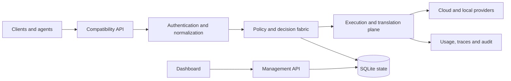

# AIMix Architecture

## Purpose

AIMix separates protocol compatibility from provider-independent decision logic. This keeps direct provider routes predictable while allowing policies, health, cost, and governance to evolve without leaking provider details into every application layer.

## System context



## Layer boundaries

| Layer | Primary paths | Responsibility |
| --- | --- | --- |
| Product and API | `src/app` | Dashboard, compatibility routes, management routes |
| AIMix fabric | `src/aimix` | Decisions, policy, context, reliability, evaluation, governance |
| Application streaming | `src/sse` | Request entry points and application-level orchestration |
| Compatibility plane | `open-sse` | Provider registry, executors, translators, streaming primitives |
| Runtime services | `src/lib` | Persistence, auth, integrations, update and host services |
| Distribution | `cli`, `sdk`, `skills` | Launchers, client libraries, and agent-facing capabilities |

Dependencies should point inward toward stable contracts. UI and routes may call domain services; domain services must not import UI components. Provider-independent AIMix modules should not depend on provider-specific executors.

## Request lifecycle

```text
authenticate
  → normalize protocol
  → classify workload and sensitivity
  → resolve direct route or adaptive policy
  → apply hard constraints
  → score eligible candidates
  → enforce budget, health and capacity controls
  → optimize context and check cache
  → translate and execute upstream
  → validate response or traverse fallback
  → record usage, trace and audit data
  → stream the canonical response
```

Hard constraints run before weighted scoring. Privacy, authorization, required capability, hard budgets, and unavailable providers cannot be traded for a better soft score.

## Provider model

Provider manifests are stored in `open-sse/providers/registry`. The generated `index.js` is rebuilt with `npm run generate:providers`; manual edits are rejected by `npm run check:structure`. Standard OpenAI-compatible services use the generic executor. Specialized executors are reserved for protocols that cannot be expressed by declared transports and translators.

The universal ecosystem catalog in `src/aimix/ecosystem` is broader than the active runtime registry. Lifecycle states distinguish supported runtime integrations from verified, planned, or discovered candidates.

## State and migrations

Application state is stored beneath `DATA_DIR`, using SQLite with the configured driver chain. Schema changes are append-only migrations under `src/lib/db/migrations`. Migrations must be deterministic, tested against existing state, and accompanied by rollback or recovery guidance when data representation changes.

Secrets must not be written to traces, test snapshots, or logs. Content logging is opt-in and should be disabled for sensitive deployments.

## Reliability

AIMix combines account fallback, provider health, bounded retries, circuit breakers, typed fallback edges, deadlines, and concurrency controls. Fail-open behavior is limited to optional optimization layers; authentication, authorization, data classification, and hard-policy checks fail closed.

## Extensibility

- Provider manifests add upstream capabilities and transports.
- Translators add protocol conversion through registered routes.
- Plugins add isolated capabilities through validated contracts.
- Tool manifests describe permissions, secrets, schemas, and transports.
- Compatible endpoints allow local runtimes without core patches.

Discovery produces a read-only plan and profiles supplied observations. It must not blindly probe user-controlled network targets.

## Verification strategy

Routine CI and unit tests use fixtures and local doubles; they do not require real provider credentials. Real-provider suites are explicitly opted in and must never run as an implicit side effect of build, lint, or unit-test commands.

Architecture changes should include focused tests, structural validation, migration coverage when applicable, and updated public documentation.
